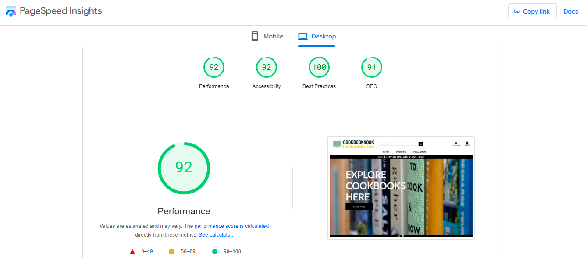
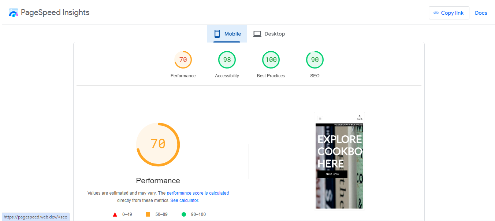
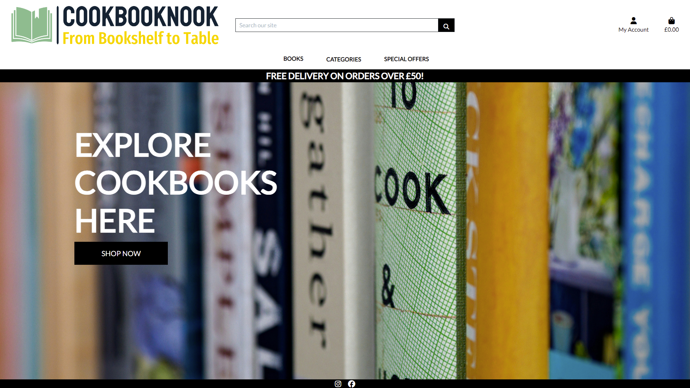

# Testing
I conducted manual testing throughout the project development, ensuring that each component was thoroughly tested as it was implemented. To inspect code and its effect on the rendered site simultaneously, I utilized Google Chrome DevTools in the browser.

## Google's Lighthouse Performance
Google Chrome Dev Tools Lighthouse function to check the performance, accessibility and search engine optimization with scores documented below.

#### Desktop

  

#### Mobile

  

### Browser Compatibility

I've personally tested the website on Android and Windows laptops, and everything is displaying correctly. Additionally, I've asked friends and family to access it on Macs and other devices, and they have confirmed that it works well for them too.

### Responsiveness
Website is fully responsive, with use of 4 breakpoints:

- 375px - mobile size,
- 768px - tablet size,
- 1440px - desktop size,
- 1950px - desktop large size.

## Manual Testing user stories

* Home Page Desktop view

  

* Home Page Mobile view

  

- As a first time user I can see with the information in the homepage what the site is about. Login and register links can be seen in the navigation bar. A footer can be seen with social media links. 

- The mobile view, the navigation bar is changed to 3 small bars for better user experience. 

#### Register Page 

- A form is present to sign up to the site. email, username, and password inputs are seen. As well with a back to login and signup button. 

- Above the form is a link for the user if they have mistaken the wrong click and is already registered. They can click on to the link to be redirected to the login page.

- When filling the form, the below images show the tooltip working as it should, if an input field is not filled in, the field is let known to the user. 

- If username or email have been used, the user is alerted with a flask messge of "Username or email already exists". 

- When form is filled correctly, the user is registered and redirected to the home page, with a "Successfully signed in as (USERNAME)" alert top right of page. 

#### Profile Page 

- When the user login with the correct creditials, the user is re-directed to the homepage. In the nav bar on top, under the account icon, the user can click on their profile page. From here, the user can see/update their details, see their order history and click a button to direct them to their wishlist. 

#### Navigation Bar - Categories  

- A dropdown menu with all categories, is seen when user clicks over the categories heading on the nav-bar. 

- When a user clicks on a category, it redirects the user to books within the choosen category. 

.png)
- When user clicks add category, they are redirected to the categories page and will see that their category had been made and appears on the page.

.png)

- If the user chooses to edit a category they just click on the edit button and get redirected to the edit category page. Where there is a edit category button.
.png)

- If user goes and edits the description and clicks on the button, the site will redirect the user to the categories page and with the updated description seen in the category Vegetables.  

.png)

- If user wanted to delete category, a confirmation to delete it will come up when the user clicks on delete. This helps with accidental clicks. 

.png)

- If the user does want to continue with deletion, then the category is deleted from the site, user is redirected with the updated categories page. Where they will see the category is no longer there. 

#### Recipes Page

- When the user locates to the recipe page, recipe cards can be seen. An image is seen on the recipe and the stock image that is rendered if user does not paste a URL link can be seen on 2nd recipe card.  

- The user can not see and edit or delete buttons on the recipe cards as they do not have access to edit/delete recipes that have not been posted by them. 

- User can see basic recipe info such as description, serves and cooking time, who posted it. This is see if the image or three dots are clicked on. 

.jpg)

- If user clicks on the link "click for recipe" they will be redirected to the recipe decription page, where the full details of the recipe can be seen. As seen below. 
.png)

#### Add Recipe - accessed by the tab "Add recipe" or green floating button by recipes title
.png)

- From the images as you can see, a tooltip can be seen in the add recipe form if a input field is missing from the user. The recipe will not be added if the fields are not filled in. However the image is optional. 

- The user will not choose to put an image so we can see the loading of the stock image. 

.png)
.png)
.png)
.png)
.png)
.png)
.png)

- When the form is submitted, the recipe is seen to be added to the recipes page. The edit/delete floating buttons can now be visible to the user on their recipe card they have created but not the others recipes. A flask message will appear to confirm successful recipe added. 

- Stock image can be seen on the recipe made by the test user. Which shows that the path url works as it should. 

.png)

- If the user proceeds to edit their recipe the button directs the user to the edit recipe page. When a similar form to the add recipe is seen, but filled in with the data the user had inputted. 

.png)

- The user has the option to update the recipe or cancel which will render the user back to the recipes page. 

- If the user decides to delete their recipe, they will be prompted to confirm deletion again for extra percaution. 

.png")

- If user proceeds with the deletion, they are redirected to the recipes page where there recipe they created has now been removed from the site. Flask message will appear to confirm deletion. 

.png")

#### Logout 

- The user can click on the logout tab in the navigation bar. It will log them out and render them back to the login page. A flask message to confirm logout is seen. 

.png)

### 404 Error Page 

- This works as it should. 

#### Mobile Nav Bar 

- Functional mobile nav bar can be seen. Easy and clear to use. 

## Code Validation

### HTML

I used [W3 HTML Validator](https://validator.w3.org/) to validate all HTML files by URI, pasting the web address, checking to ensure no errors were found. After changing the aria-labelledby attribute to point to an element in the same document no error or warnings found. 

W3 HTML Validator (https://validator.w3.org/) to validate all HTML files by URI, 

#### Web Address

#### Homepage

#### Register

#### Signin

#### Profile

#### Books Page

#### Book Detail

#### Wishlist

#### Shopping Bag

#### Checkout

#### Add Book

#### Add Category

#### Manage Books

#### Order History

### CSS

W3 CSS Validator (https://jigsaw.w3.org/css-validator/validator) to validate the style.css file. 

#### Base.css

#### Profile.css

#### Checkout.css

### Python PEP8

Code Institue Python Linter (https://pep8ci.herokuapp.com/)

Flake8 was used to check the python code to be PEP8 compliant. PEP8 only shows the type of errors that can be ignored, like the migration files. 

[Back to README](README.md)